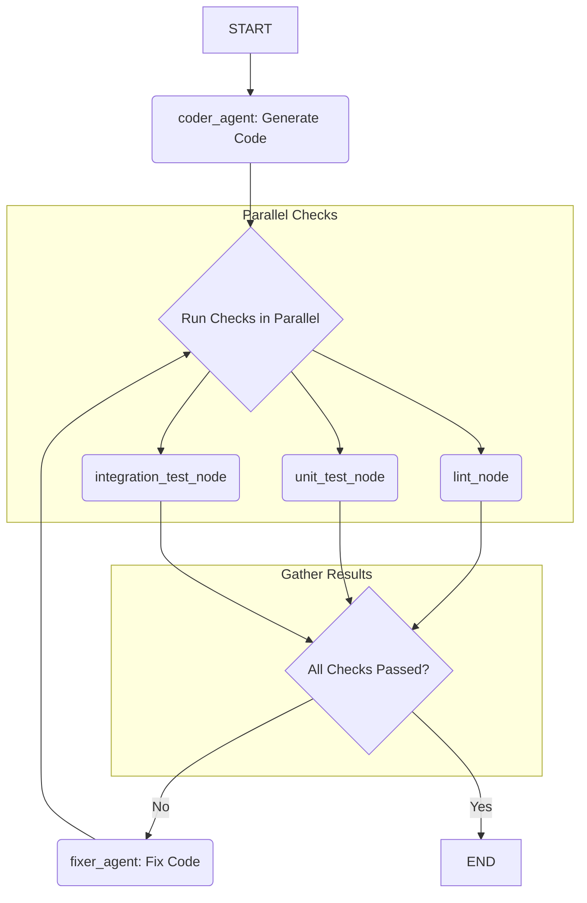

# Programmatic Coder Workflow

This sample demonstrates a programmatic workflow, built using `@node` decorators, that uses native Python control flow (loops, conditionals, async) to manage a code generation and review process.

- NOTE: This is an educational tool to show ADK features. It WILL NOT lint check or run tests the way it is currently implemented

## 1. Architecture

This workflow automates the process of writing, linting, testing, and fixing code.

1.  **`coder_agent`**: An `LlmAgent` that writes the initial Python code based on a user's request.
2.  **Check Nodes (`lint_node`, `unit_test_node`, `integration_test_node`)**: These are Python functions wrapped with the `@node` decorator. They are run in parallel to check the code quality.
3.  **`fixer_agent`**: If any checks fail, this `LlmAgent` is called to debug the code based on the error findings.
4.  **`code_review_workflow`**: The main workflow function, decorated with `@workflow`. It uses an `async` function and a `for` loop to manage the generate-test-fix cycle, and `asyncio.gather` to run checks in parallel.



## 2. Feature: Programmatic Workflows

This sample showcases the power of programmatic workflows for creating dynamic and flexible agentic processes:

- **`@workflow` and `@node` Decorators**: These decorators allow you to define workflows and nodes using simple Python functions, reducing boilerplate code.
- **Sequential Execution**: The workflow follows a clear sequence, starting with code generation (`await ctx.run_node(...)`).
- **Parallel Execution**: It uses `asyncio.gather` to run the linter and multiple types of tests concurrently, which is much more efficient than running them one by one.
- **Loop and Conditional Logic**: It uses a standard Python `for` loop and `if/else` statements to create a retry mechanism. The workflow attempts to fix failing code up to a maximum number of retries, demonstrating complex control flow that would be difficult to represent in a static graph.

## 3. Deployment Guide

To deploy this workflow agent, you can use the `adk deploy` command.

### Prerequisites

Ensure you have authenticated with Google Cloud:
```sh
gcloud auth application-default login
```

Your GCP `project` and `location` should be set in a `.env` file in the root of this project.

### Deployment Command

```sh
adk deploy workflow-programmatic-coder/agent.py:root_agent --display-name "Programmatic Coding Agent"
```

### Example Use

After deploying, you can invoke the agent with a request for a Python function.

**Example Input:**
> "Write a Python function that takes a list of integers and returns the sum of all the even numbers."

The workflow will then:
1.  Generate the initial code.
2.  Run a linter and tests in parallel.
3.  If they fail, it will loop, attempting to fix the code.
4.  Return the final, passing code.

Because the mock testing tools are designed to fail randomly, you can run the agent multiple times to see the loop and fix mechanism in action.
